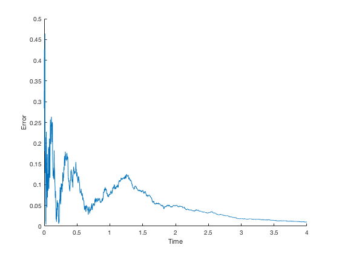
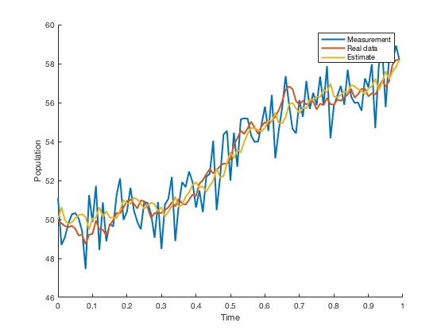
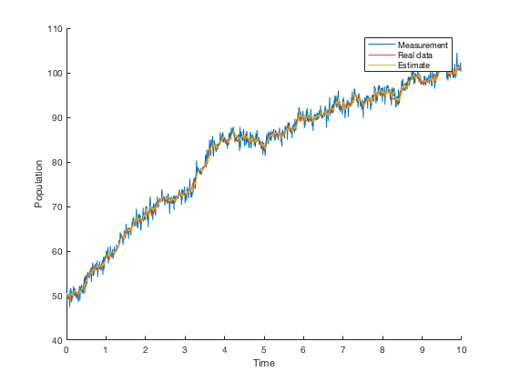
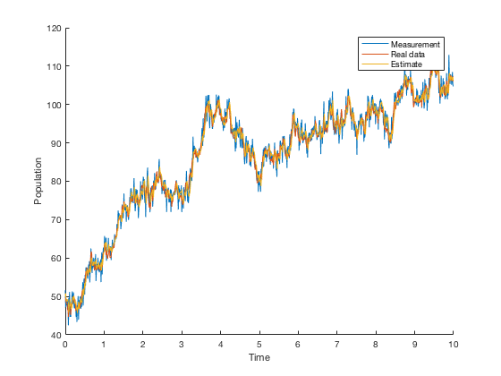
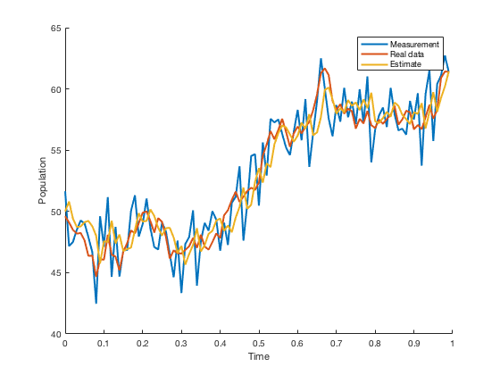
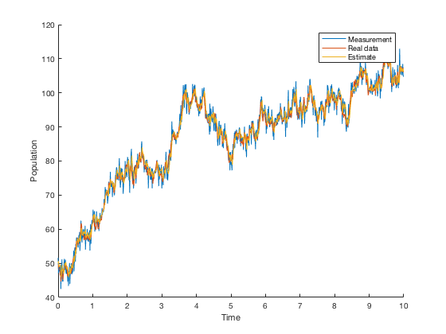
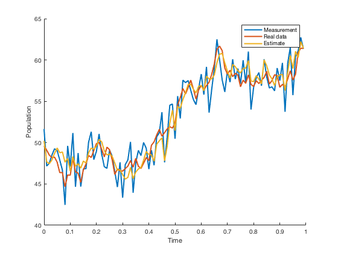
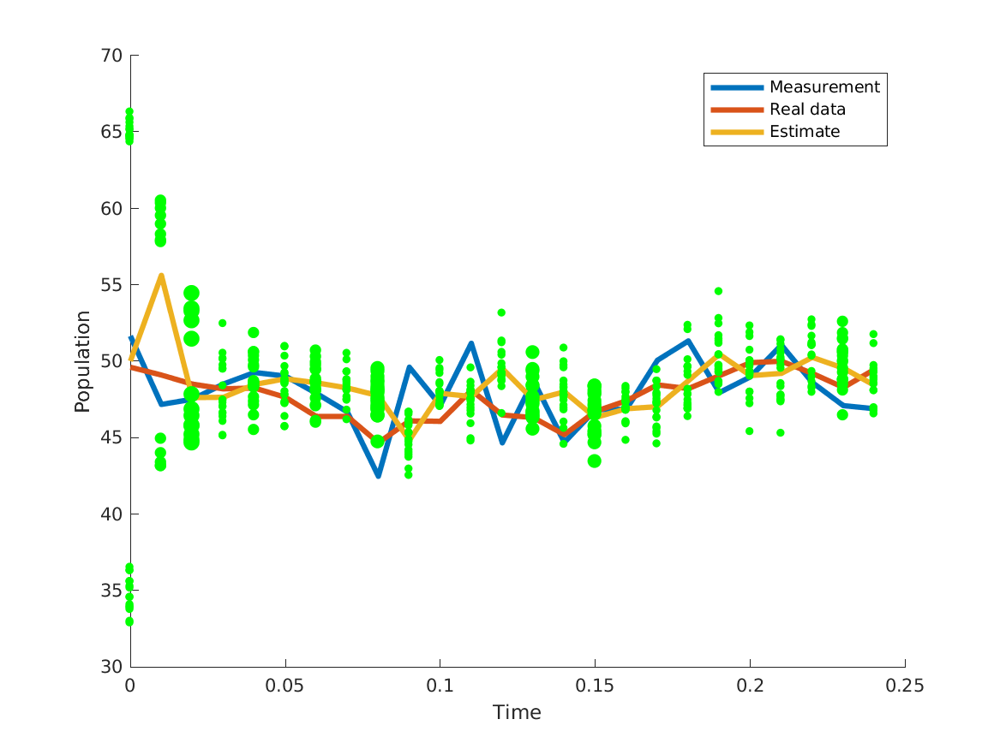

# Kalman filter 

This repository contains various implementations in `Matlab` and `C++` of different flavours of the Kalman filter. The insipiration to create this repository is [this](https://github.com/rlabbe/Kalman-and-Bayesian-Filters-in-Python) great introduction to the Kalman filter which also aims to provide users a basic and ready to use arsenal to use in exploring filtering. 


We will first discuss the `matlab_implementation` since it has the _meat_ of the implementations in addition to the fact that `c++_implementation` is only a partial `C++` copy of the former. Both sections will discuss basic examples for how to use them. The matlab code (which 99% of can be used in octave) has extensive documentation so if you are ever want more information just type `help function_you_are_trying_to_use`. If you have further questions or want to contribute then feel free to reach me at `contact at zonov dot ca` - ideally this repository will become a collection of various Kalman filter based implementations in different languages for anyone to use and refer to.

1. [`matlab_implementation`](#matlab_imp)
	1.  [`continuous_continuous`](#cont_cont)
	2.  [`steady_state`](#ss)
	3. [`continuous_discrete`](#cd)
	4. [`discrete_discrete`](#dd)
	5. [`unscented`](#ukf)
	6. [`ensemble_stochastic`](#enkf_stochastic)
	7. [`particle_filter`](#particle_filter)
2. [`c++_implementation`](#c++_imp)
3. Testing
4. Further reading

### 1. `matlab_implementation` <a name="matlab_imp"></a> 
All of this code can be used in Octave (except `steady_state`)

* **`continuous_continuous`**:<a name="cont_cont"></a> The states evolves continuously in time and the measurements are also continuous in time. In this implementation only the covariance `P(t)` is solved for through the Differential Riccati equation and that only works for linear systems. A basic numerical scheme is used so the code should only be used for small state count (_works for both Matlab and Octave_).
   
  Running the code:
  
  ```matlab
  clear all;
  addpath('path_to/matlab_implementation/continuous_continuous');
  C = [1, 0.1]; %observation matrix to obtain measurement y (y = C*x + noise)
  A = [-1,0.2;-0.1,-1]; %(d/dt)x(t) = A*x(t)
  R_c = [0.1^2]; %continuous sensor noise
  Q_c = [0.001^2,0;0,0.001^2]; %continuous process noise
  P_0 = eye(2);%initial covariance
   
  %next three variables dictate time step size
  t_start = 0;
  t_final = 20;
  outputs = 10000;
  
  covariances = cckf(t_start,t_final,outputs,P_0,A,C,R_c,Q_c);
  	
  covariances{1}%at t = 0
  covariances{2000}%at t = 1.999 
  format long;
  covariances{end}%at t = 19.999 
  ``` 
  produces the output:

  ```matlab
  ans =
   1   0
   0   1
  
   ans =
   1.0e-03 *
    0.0824    0.1174
    0.1174    0.1867
  
  ans =
   1.0e-06 *
   0.504888842493018   0.024508560850297
   0.024508560850297   0.497548868164108
  ```
  
* **`steady_state`** <a name="ss"></a>: The steady state of `continuous_continuous` Kalman filter which is equivalent to when `\dot{P}(t)` goes to zero and reduces the Differential Riccati equation to the Continuous Algebraic Riccati equation (_works in Matlab only_).
  
  Running the code:
  ```matlab
  %Matlab only
  addpath('path_to/matlab_implementation/steady_state');
  %using variables from continuous_continuous 
  P_steady = sskf(A,C,Q_c,R_c)
  ```
  
  produces the output
  ```matlab
  ans = 
  
  1.0e-06 *
  
   0.504888842491879   0.024508560851831
   0.024508560851831   0.497548868161834
  ```
  which is similar to the covariance at `t=19.999` for `continuous_continuous` example.
* **`continuous_discrete`**<a name="cd"></a>: The state evolves continuously in time while the measurements are discrete in time. The code computes both the estimate and covariance matrix `P(t)`. The covariance is returned at the measurement points. (_works in Matlab and Octave_). In this example and the rest featured, the process and sensor noise is added by taking the square root of the associated covariance matrix. This works because the covariance matrix is a diagonal matrix and the square root generates a diagonal of standard deviations. For a general covariance matrix use the `mvnrnd` command.
  
  Running the code: 
  ```matlab
  %LINEAR EXAMPLE
  addpath('path_to/matlab_implementation/continuous_discrete');
  %same parameters as for steady_state and continuous_continuous except sensor
  %matrix is scaled based on time distance between measurements 
  dt = (t_final-t_start)/outputs;
  R_d = (1/dt).*R_c;

  %generate data and measurements 
  %~~~~~~~~~~~~~~~~~~~~~~~~~~~~~~~~~~~~~
  x_0 = [100; 80]; %initial real data state
  state_count = length(x_0);
  sensor_count = 1;
  ideal_data = zeros(state_count,outputs); %data with no process noise
  process_noise_data = zeros(state_count,outputs);
  measurements = zeros(sensor_count,outputs);
  x = x_0;
  x_noise = x_0;
  
  isOctave = exist('OCTAVE_VERSION', 'builtin') ~= 0;
  if isOctave==true
  	randn("seed",1);
  else
  	rng(1);
  end
  for ii=1:outputs
  	x = x + dt.*(A*x);%Explicit Eulers
  	ideal_data(:,ii) = x;%the first column of ideal_data and process_noise_data is x_1
  	x_noise = x_noise + dt.*(A*x_noise) + sqrt(dt.*Q_c)*randn(state_count,1);%Euler-Maruyama
  	process_noise_data(:,ii) = x_noise;
  	measurements(ii) = C*x_noise + sqrt(R_d)*randn(sensor_count,1);
  end
  %~~~~~~~~~~~~~~~~~~~~~~~~~~~~~~~~~~~~~
  
  %set up arguments
  if isOctave==true
  	f_func = @(x,t) A*x + 0.*t;
  	jacobian_func = @(x,t) A + 0.*x + 0.*t;
  else
  	f_func = @(x,t) A*x + 0.*t;
  	xx = sym('x',[state_count,1]);
  	jacobian_func = matlabFunction(jacobian(A*xx,xx),'Vars',{xx});
  	jacobian_func = @(x,t) jacobian_func(x) + 0.*t;%no dependence on t
  end
  
  rk4_steps = 4;%type 'help cdekf' for more info 
  [estimates,covariances] = cdekf(f_func,jacobian_func,dt,rk4_steps,t_start,...
  	state_count,sensor_count,outputs,C,chol(Q_c)',chol(R_d)',chol(P_0)',x_0,measurements);
  ```

  Now let's look at some results:
  ```matlab
  error = zeros(1,outputs);
  for ii=1:outputs
  	error(ii) = norm(C*estimates(:,ii+1) - C*process_noise_data(:,ii));
  end
  h = figure;
  hold on;
  times = 0:dt:((outputs-1)*dt);
  times_sub = times(1:round(length(times)/5));
  plot(times_sub,error(1:length(times_sub)));
  xlabel('Time')
  ylabel('Error')
  
  ```

   

  This figure shows the error between the real state (`process_noise_data`) based measurement and the estimate based measurement. Running:
  
  ```matlab
  format long;
  covariances{end}
  ```
  produces same result as `steady_state` and `continuous_continuous`:
  
  ```matlab
  ans =
  
  1.0e-06 *
  
   0.504888858401663   0.024508554995859
   0.024508554995859   0.497548909278748
  ```
   
  The model used in this example was linear. The `cdekf` stands for continuous-discrete extended Kalman filter and can be used for nonlinear systems (for linear the `cdekf` is equivalent to a regular continuous-discrete Kalman filter). We will now run an example with a nonlinear system.     
   
  Run the following code: 
  
  ```matlab
  clear all;
  addpath('path_to/matlab_implementation/continuous_discrete')
  rate = 0.5; 
  max_pop = 100;
  deriv_func = @(x) rate*x*(1 - x/max_pop);%logistic population model (quadratic in x)
  
  isOctave = exist('OCTAVE_VERSION', 'builtin') ~= 0;
  if isOctave==true
  	jacobian_func = @(x) rate - (2*x*rate)/max_pop;%manual derivative - octave might have its own function
  else
  	xx = sym('x',[1,1]);
  	jacobian_func = matlabFunction(jacobian(deriv_func(xx),xx),'Vars',xx);
  end
  
  deriv_func = @(x,t) deriv_func(x) + 0.*t; 
  jacobian_func = @(x,t) jacobian_func(x) + 0.*t;
   
  t_start = 0;
  t_final = 10;
  outputs = 1000;
  dt = (t_final - t_start)/outputs;
   
  R_c = 0.01; 
  R_d = (1/dt)*R_c;
  Q_c = 10;
  C = 1;
   
  %generate data and measurements
  state_count = 1; 
  sensor_count = 1;
  x_0 = max_pop/2;
  ideal_data = zeros(state_count,outputs); %data with no process noise
  process_noise_data = zeros(state_count,outputs);
  measurements = zeros(sensor_count,outputs);
  x = x_0;
  x_noise = x_0;
   
  if isOctave==true
  	randn("seed",1);
  else
  	rng(1);
  end
  
  for ii=1:outputs
  	x_noise = x_noise+dt.*deriv_func(x_noise,0)+sqrt(dt.*Q_c)*randn(state_count,1);%Euler-Maruyama
  	process_noise_data(:,ii) = x_noise;
  	x = x + dt.*deriv_func(x,0);%Explicit Eulers /time independent
  	ideal_data(:,ii) = x;
  	measurements(ii) = C*x_noise + sqrt(R_d)*randn(sensor_count,1);
  end
  
  P_0 = 1;
  rk4_steps = 1;%internal for code - type 'help cdekf' for more info 
  [estimates,covariances] = cdekf(deriv_func,jacobian_func,dt,rk4_steps,t_start,...
  	state_count,sensor_count,outputs,C,chol(Q_c)',chol(R_d)',chol(P_0)',x_0,measurements);
  ```
  
  We plot the results with
  ```matlab
  h = figure;
  hold on;
  plot(0:dt:(100-1)*dt,measurements(1:100),'LineWidth',2); 
  plot(0:dt:(100-1)*dt,process_noise_data(1:100),'LineWidth',2);
  plot(0:dt:(100-1)*dt,estimates(1:100),'LineWidth',2);
  legend('Measurement','Real data','Estimate');
  xlabel('Time')
  ylabel('Population')
  ```
   
  
  
  and a global view:
  ```matlab
  h = figure;
  hold on;
  plot(0:dt:(outputs-1)*dt,measurements); 
  plot(0:dt:(outputs-1)*dt,process_noise_data);
  plot(0:dt:(outputs-1)*dt,estimates(1:end-1));
  legend('Measurement','Real data','Estimate');
  xlabel('Time')
  ylabel('Population')
  ```
  
  
   
  The implementation of `continuous_discrete` and the following `discrete_discrete` is implemented in a way to ensure that the covariance Matrix `P(t)` is semi-positive definite through the use of a square root type algorithm (which is explained nicely in Kailath's book). For `continuous_discrete`, the state and covariance matrix are evolved using RK4 in combination with square root algorithm where the code allows for the opportunity of decreasing timestep for increased accuracy (`rk4_steps`). 
 
* **`discrete_discrete`**<a name="dd"></a> : The state evolves discretely and the measurements are discrete in time. The code computes both the estimate and covariance matrix `P(t)`. The `continuous_continuous` can be approximated by scaling `Q` by `dt` and `R` by `1/dt`. The update phase remains unchanged between `continuous_discrete` and `discrete_discrete`. 
  
  Run the following code:
  
  ```matlab
  clear all;
  addpath('path_to/matlab_implementation/discrete_discrete');  
  rate = 0.01;
  max_pop = 100;
  next_func = @(x,t) x + rate.*x.*(1 - x/max_pop);%discrete version of logistic growth x_{k+1} = f(x_{k})
  jacobian_func = @(x,t) 1 + rate - (2*rate*x)/max_pop  + 0.*t;
  
  t_start = 0;
  t_final = 10;
  outputs = 1000;
  dt = (t_final - t_start)/outputs;
 
  Q_d = 1;
  R_d = 3;
  C = 1;
 
  %generate data and measurements
  state_count = 1; 
  sensor_count = 1;
  x_0 = max_pop/2;
  ideal_data = zeros(state_count,outputs); %data with no process noise
  process_noise_data = zeros(state_count,outputs);
  measurements = zeros(sensor_count,outputs);
  x = x_0;
  x_noise = x_0;
  
  isOctave = exist('OCTAVE_VERSION', 'builtin') ~= 0;
  if isOctave==true
  	randn("seed",1);
  else
  	rng(1);
  end

  for ii=1:outputs
  	x = next_func(x,0);%t=0 because function is time independent
  	ideal_data(:,ii) = x;
  	x_noise = next_func(x_noise,0) + sqrt(Q_d)*randn(state_count,1);
  	process_noise_data(:,ii) = x_noise;
  	measurements(ii) = C*x_noise + sqrt(R_d)*randn(sensor_count,1);
  end
  
  P_0 = 1;
  [estimates, covariances ] = ddekf(next_func,jacobian_func,dt,t_start,state_count,...
  	sensor_count,outputs,C,chol(Q_d)',chol(R_d)',chol(P_0)',x_0, measurements);
  ```
  
  We plot the results: 
 
  ```matlab
  h = figure;
  hold on;
  plot(0:dt:(outputs-1)*dt,measurements); 
  plot(0:dt:(outputs-1)*dt,process_noise_data);
  plot(0:dt:(outputs-1)*dt,estimates(1:end-1));
  legend('Measurement','Real data','Estimate');
  xlabel('Time')
  ylabel('Population')
  ```
  
   
  
  and a more zoomed in plot:
  
  ```matlab
  h = figure;
  hold on;
  plot(0:dt:(100-1)*dt,measurements(1:100),'LineWidth',2); 
  plot(0:dt:(100-1)*dt,process_noise_data(1:100),'LineWidth',2);
  plot(0:dt:(100-1)*dt,estimates(1:100),'LineWidth',2);
  legend('Measurement','Real data','Estimate');
  xlabel('Time')
  ylabel('Population')
  ```
  
    
  
  For a linear system `ddekf` reduced to the regular discrete discrete Kalman filter. Borrowing parameters from `continuous_continuous` we can approximate the continuous with the discrete discrete Kalman filter.

  Run the code:

  ```
  %LINEAR EXAMPLE
  clear all;
  C = [1, 0.1]; %observation matrix to obtain measurement y (y = C*x + noise)
  A = [-1,0.2;-0.1,-1]; %(d/dt)x(t) = A*x(t)
  R_c = [0.1^2]; %continuous sensor noise
  Q_c = [0.001^2,0;0,0.001^2]; %continuous process noise
  P_0 = eye(2);%initial covariance
  state_count = 2; 
  
  t_start = 0;
  t_final = 20;
  outputs = 10000;
  dt = (t_final-t_start)/outputs;
  
  A_d = eye(2) + dt.*A;%x_{k+1} = A_d*x_k
  Q_d = dt.*Q_c;
  R_d = (1/dt).*R_c;
  
  func = @(x) A_d*x;
  isOctave = exist('OCTAVE_VERSION', 'builtin') ~= 0;
  if isOctave==true
  	jacobian_func = @(x) A_d + 0.*x;
  else
  	xx = sym('x',[state_count,1]);
  	jacobian_func = matlabFunction(jacobian(func(xx),xx),'Vars',xx);
  end
  func = @(x,t) func(x) + 0.*t; 
  jacobian_func = @(x,t) jacobian_func(x) + 0.*t;
  
  x_0 = [100; 80]; %initial real data state
  state_count = length(x_0);
  sensor_count = 1;
  ideal_data = zeros(state_count,outputs); %data with no process noise
  process_noise_data = zeros(state_count,outputs);
  measurements = zeros(sensor_count,outputs);
  x = x_0;
  x_noise = x_0;
  
  if isOctave==true
  	randn("seed",1);
  else
  	rng(1);
  end

  for ii=1:outputs
  	x = x + dt.*(A*x);%Explicit Eulers
  	ideal_data(:,ii) = x;%the first column of ideal_data and process_noise_data is x_1
  	x_noise = x_noise + dt.*(A*x_noise) + sqrt(Q_d)*randn(state_count,1);%Euler-Maruyama
  	process_noise_data(:,ii) = x_noise;
  	measurements(ii) = C*x_noise + sqrt(R_d)*randn(sensor_count,1);
  end
  
  [estimates, covariances ] = ddekf(func,jacobian_func,dt,t_start,state_count,...
  	sensor_count,outputs,C,chol(Q_d)',chol(R_d)',chol(P_0)',x_0, measurements);

  ```

  Now let's see the results:

  ```
  covariances{end}
  ```
  
  produces

  ```
  ans =

  1.0e-06 *
  
  0.505404333754918   0.024508532015743
  0.024508532015743   0.498056883303343
  ```
  
  which is similar to the the covariance computed in the `continuous_discrete` and `continuous_continuous` examples.

  
* **`unscented`**<a name="ukf"></a> : The state evolves discretely and the measurements are discrete in time. The filter is the Unscented Kalman filter. 
  
  Run the following code:
   
  ```matlab
  %run same code as in the nonlinear(logistic-growth model) discrete_discrete section
  addpath('path_to/matlab_implementation/unscented');
  %The implementation of the ukf code allows for time
  %variant versions of the observation matrix C, Q, R and
  %provides an example as to how to modify other matlab implementations
  %(continuous_discrete/discrete_discrete) to be modified for time
  %variant parameters 
  C_ukf = @(x,i) C*x + 0.*i;
  Q_d_ukf = @(i) Q_d + 0.*i;
  R_d_ukf = @(i) R_d + 0.*i;
  
  [estimates_ukf, covariances_ukf] = ukf(next_func, state_count, sensor_count,...
  	 outputs,C_ukf,Q_d_ukf,R_d_ukf,P_0,x_0, measurements);%no need for jacobian 
  ```
  
  using the plot scripts

  ```matlab
  h = figure;
  hold on;
  plot(0:dt:(outputs-1)*dt,measurements); 
  plot(0:dt:(outputs-1)*dt,process_noise_data);
  plot(0:dt:(outputs-1)*dt,estimates_ukf(1:end-1));
  legend('Measurement','Real data','Estimate');
  xlabel('Time')
  ylabel('Population')
  ```
  
   
  
  and a more zoomed in plot:
  
  ```matlab
  h = figure;
  hold on;
  plot(0:dt:(100-1)*dt,measurements(1:100),'LineWidth',2); 
  plot(0:dt:(100-1)*dt,process_noise_data(1:100),'LineWidth',2);
  plot(0:dt:(100-1)*dt,estimates_ukf(1:100),'LineWidth',2);
  legend('Measurement','Real data','Estimate');
  xlabel('Time')
  ylabel('Population')
  ```
   
    

  `ukf2.m`, located in the same directory, is a faster implementation of `ukf.m` for cases when then the observation and noise matrices are constants.

  ```matlab
  [estimates_ukf2, covariances_ukf2] = ukf2(next_func, state_count, sensor_count, outputs,C,Q_d,R_d,P_0,x_0, measurements);

  max_err = max(abs(estimates_ukf - estimates_ukf2))
  ```
  `max_err` is the max error between the `ukf.m` and `ukf2.m` code. The implementations are equivalent as the error is on machine error level (on the order of `1e-14`).
  
  Going back to the linear example (run the linear code in `discrete_discrete`) and then run:
  ```
  C_ukf = @(x,i) C*x + 0.*i;
  Q_d_ukf = @(i) Q_d + 0.*i;
  R_d_ukf = @(i) R_d + 0.*i;
  func = @(x) func(x,0);
  [estimates_ukf, covariances_ukf] = ukf(func, state_count, sensor_count,...
  	outputs,C_ukf,Q_d_ukf,R_d_ukf,P_0,x_0, measurements);%no need for jacobian 
  covariances_ukf{end}
  
  ```
  produces the output
  ```
  ans =

   1.0e-06 *

   0.505404385338335   0.024508539563919
   0.024508539563919   0.498056884407876
  ```
  which is similar to the covariance produced in `continuous_discrete`, `continuous_continuous` and `discrete_discrete` examples.

  
* **`ensemble_stochastic`**<a name="enkf_stochastic"></a> : The state evolves discretely and the measurements are discrete in time. The filter is the stochastic Ensemble Kalman Filter (EnKF).
  
  Run the following code:
   
  ```matlab
  %run same code as in discrete_discrete section
  %addpath('path_to/matlab_implementation/ensemble_stochastic');
  
  ensemble_size = 5;
  
  [estimates_enkf,covariances_enkf] = enkf_stochastic(next_func,state_count,sensor_count,...
  	outputs,ensemble_size,C,R_d,Q_d,P_0,x_0, measurements);

  h = figure;
  hold on;
  plot(0:dt:(100-1)*dt,measurements(1:100),'LineWidth',2); 
  plot(0:dt:(100-1)*dt,process_noise_data(1:100),'LineWidth',2);
  plot(0:dt:(100-1)*dt,estimates_enkf(1:100),'LineWidth',2);
  legend('Measurement','Real data','Estimate');
  xlabel('Time')
  ylabel('Population')
  ```
  produces the plot
  
  

  For the linear example, rerun the linear example in the `discrete_discrete` to define the parameters and then run:
  ```
  func = @(x) func(x,0);
  ensemble_size = 100000;
  [estimates_enkf,covariances_enkf] = enkf_stochastic(func,state_count,sensor_count,...
  	outputs,ensemble_size,C,R_d,Q_d,P_0,x_0, measurements);
  covariances_enkf{end}
  ```
  produces the outputs
  ```
  ans =

   1.0e-06 *

   0.507035443054435   0.023754624044578
   0.023754624044578   0.495193697130903

  ```
  which once again is similar to the covariance computed in `continuous_continuous`, `discrete_discrete`,`continuous_discrete`,`unscented` and finally `steady_state`.


* **`ensemble_deterministic`**<a name="enkf_deterministic"></a>: 
  ```
  Maybe you can help implement this one :)
  ```

* **`particle_filter`**<a name="particle_filter"></a> : 
  Run the code in `discrete_discrete` for the `%LINEAR_EXAMPLE` and then comment out within `particle_filter`:
  ```
  particle_new = zeros(state_count,particle_count);
  particle_covariance_new = cell(state_count,1);
  for weight_index=1:particle_count
  	chosen_index = (find( cumulitive_profile >= rand,1));
  	particle_new(:,weight_index) = particle(:,chosen_index);
  	particle_covariance_new{weight_index} = particle_covariance{chosen_index};
  end
  particle_weight = (1/particle_count).*ones(particle_count,1);
  particle = particle_new;
  particle_covariance = particle_covariance_new;
  ``` 
  and then the following:
  ```
  addpath('path_to/matlab_implementation/particle')
  format long;
  particle_count = 30000; 
  particle = mvnrnd(x_0,P_0,particle_count)'; 
  [estimates_particle, covariances_particle] = particle_filter(func,jacobian_func,dt,t_start,state_count,sensor_count,...
  	outputs,particle_count,particle,C,chol(Q_d)',chol(R_d)',chol(P_0)',x_0, measurements);
  covariances_particle{end}
  ```
  We get the output:
  ```
  ans =

   1.0e-06 *
   
   0.500629318705446   0.027198397130451
   0.027198397130451   0.497516844921370
  ```
  which is once again similar to previous results. Note that particle count is not as big as it was for the ensemble as computation is significantly slower. It is not recommented to run with this particle count without running a `parfor` loop of sorts within the particle filter(and having good computational resources).
  
  We can modify `path_to/matlab_implementation/particle/particle_filter.m` by uncommenting the following lines:
  ```
  %%%particles = cell(measurement_count+1,1);
  %%%particles{k} = particle;
  ```
  and change the function header to have two additional outputs:
  ```
  function [estimates, covariances, particles] = ...
  ```
  This gives the ability to view the particles used in the filter in more detail. We will use the nonlinear population model from before meaning that the code in `discrete_discrete` must be rerun (the logistic growth section). Now run:
  ```
  particle_count = 30; 
  particle1 = mvnrnd(x_0-15,P_0,particle_count/2)';
  particle2 = mvnrnd(x_0+15,P_0,particle_count/2)';
  particle = [particle1,particle2];
  [estimates_particle, covariances_particle, particles] = particle_filter(next_func,jacobian_func,dt,t_start,state_count,sensor_count,...
	outputs,particle_count,particle,C,chol(Q_d)',chol(R_d)',chol(P_0)',x_0, measurements);
  ```
  In the example we split the particles into two sets both with mean 15 away from true mean x_0 (in order to test the filter). Let's see the results:
  ```
  h = figure;
  hold on;
  lim = 975;
  plot(0:dt:(outputs-lim-1)*dt,measurements(1:end-lim),'LineWidth',3); 
  plot(0:dt:(outputs-lim-1)*dt,process_noise_data(1:end-lim),'LineWidth',3);
  plot(0:dt:(outputs-lim-1)*dt,estimates_particle(1:end-lim-1),'LineWidth',3);
  
  for ii=1:(outputs-lim)
  	[xUnique, ignore, ixs] = unique(particles{ii});
  	counts = zeros(size(xUnique,1),1);
  	for ix = 1:size(counts,1);
  		counts(ix) = sum(ixs == ix);
  	end
  	scatter(dt*(ii-1)*ones(length(xUnique),1),xUnique,counts*20,'g','filled');
  end
  legend('Measurement','Real data','Estimate');
  xlabel('Time')
  ylabel('Population')
  ```
   
  The green dots represent the particles were the thicker dots are where the particles have a higher frequence. The particle filter recovers quickly from the incorrect guess.


### 2. `c++_implementation` <a name="c++_imp"></a> 

To run the `C++` code you will need the [Eigen library](https://eigen.tuxfamily.org/index.php?title=Main_Page) which is responsible for Matrix manipulations. Instructions to download the library and install can be easily found online (the code has been only testing in a Ubuntu environment). Two examples are provided to showcase how to use the code. In the previous section, discussing the matlab code, the code was 'verified' by comparing the steady state covariance matrix as well as general filter performance. In this section, the examples are used to show the equivalence between the matlab implementation and the `C++` implementation in terms of output. The only two implemented types of filter are the discrete-discrete and continuous-discrete extended Kalman filter. Both classes inherit from a superclass that describes a general Kalman filter containing a predict and update phase. The `KalmanFilter.h` superclass contains a few virtual functions some of which are
```
virtual void predict() = 0;
virtual void update() = 0;
virtual void filter() = 0;
virtual Eigen::MatrixXd getP()
```
These functions are dependent on the filter type and are are implemented in the inheriting classes such as `continuousDiscreteExtendedKalmanFilter.h` and `discreteDiscreteExtendedKalmanFilter.h`. Other virtual methods such as
```
virtual Eigen::VectorXd f(Eigen::VectorXd x, double t) = 0;
virtual Eigen::MatrixXd f_jacobian(Eigen::VectorXd x, double t) = 0;
```
are model specific and depend on the context. For continuous-discrete Extended Kalman filter, `f` is such that `(d/dt)x = f(x,t)` where `x` is the state and `t` is the current time. For discrete-discrete Extended Kalman filter, `f` is such that `x_{k+1} = f(x_{k},k)` where `k` is the time step. In `KalmanFilter/c++_implementation/test/sample_code2` there is a class `test` that inherits from `discreteDiscreteExtendedKalmanFilter` and implements `f` and `f_jacobian`. `f` and `f_jacobian` parameters are loaded in from `.txt` files that are created in `KalmanFilter/testing/testing_discreteDiscereteKalmanFilter/matlab_generate.m` where the specific details of `f`
are found in 
```
next_func = @(x,t) x + A*x + 0.*t - [aa1*x(1)^2;aa2*x(2)^2];
```
The matlab script generates a bunch of `.txt` including system based matrices as well as the actual data to filter located in `measurements.txt`. Run the script and then 
```
$ cd KalmanFilter/c++_implementation
```
Open `Makefile` to edit. Make sure the `all:` line is set to 
```
all: setup sample_code2 
```
In addition, modify 
```
INC := -I include -I /usr/local/include/eigen3/
```
to point to the Eigen library. You can modify
```
CFLAGS := -std=c++11 -O2  # -Wall
```
to include additional flags and so forth. Once you are finished run
```
$ make 
```
in the same directory. This has compiled the `C++` code, moved the compiled code and all the `.txt` files created by `matlab_generate.m` script to `KalmanFilter/bin/sample_code2`. Move to that directory:
```
$ cd bin/sample_code2
```
and run the code 
```
./sample_code2
```
Now move the generated files to the matlab script location
```
cp output_data*.txt ../../../testing/testing_discreteDiscreteKalmanFilter
```
and `cd` to that same directory and run the matlab script `compare.m` to verify
```
c++ discrete discrete Kalman filter matches matlab implementation
```
The same message can be seen when running the same sequence of steps but for `sample_code`.

## 3. Sources

1. A very good (highly recommended) introduction to Kalman filtering concepts can be found [here](https://github.com/rlabbe/Kalman-and-Bayesian-Filters-in-Python). The repository organizes the concepts using python and a Jupyter notebook allowing the user to get a hands on intuition of the filter without getting bogged in notation and theory right away. It is a good source for understanding the implementation of the Kalman filter with respect to the predict and update phase.
2. Implementation details. Here are sources used for implemenation as well as good Kalman filter articles/books.
- Kailath, Thomas, Ali H. Sayed, and Babak Hassibi. Linear estimation. No. EPFL-BOOK-233814. Prentice Hall, 2000.
- Press, William H., et al. "Numerical recipes in C." Cambridge University Press 1 (1988): 3.
- Golub, Gene H., and Charles F. Van Loan. Matrix computations. Vol. 3. JHU Press, 2012.
- Frogerais, Paul, Jean-Jacques Bellanger, and Lotfi Senhadji. "Various ways to compute the continuous-discrete extended Kalman filter." IEEE Transactions on Automatic Control 57.4 (2012): 1000.
- Jorgensen, John Bagterp, et al. "A computationally efficient and robust implementation of the continuous-discrete extended Kalman filter." American Control Conference, 2007. ACC'07. IEEE, 2007. (not actually implementable due to square root of negative number confusion but useful information present)
- Smith, M. W. A., and A. P. Roberts. "An exact equivalence between the discrete-and continuous-time formulations of the Kalman filter." Mathematics and Computers in Simulation 20.2 (1978): 102-109.
- https://github.com/rlabbe/Kalman-and-Bayesian-Filters-in-Python
- Katzfuss, Matthias, Jonathan R. Stroud, and Christopher K. Wikle. "Understanding the ensemble Kalman filter." The American Statistician 70.4 (2016): 350-357.
- Asch, Mark, Marc Bocquet, and Maëlle Nodet. Data assimilation: methods, algorithms, and applications. Vol. 11. SIAM, 2016.
- Fowler, A. "Data Assimilation tutorial on the Kalman filter."." (2012).
- Simon, Dan. Optimal state estimation: Kalman, H infinity, and nonlinear approaches. John Wiley & Sons, 2006.
- Bar-Shalom, Yaakov, X. Rong Li, and Thiagalingam Kirubarajan. Estimation with applications to tracking and navigation: theory algorithms and software. John Wiley & Sons, 2004.
- Bucy, Richard S., and Peter D. Joseph. Filtering for stochastic processes with applications to guidance. Vol. 326. American Mathematical Soc., 2005.
