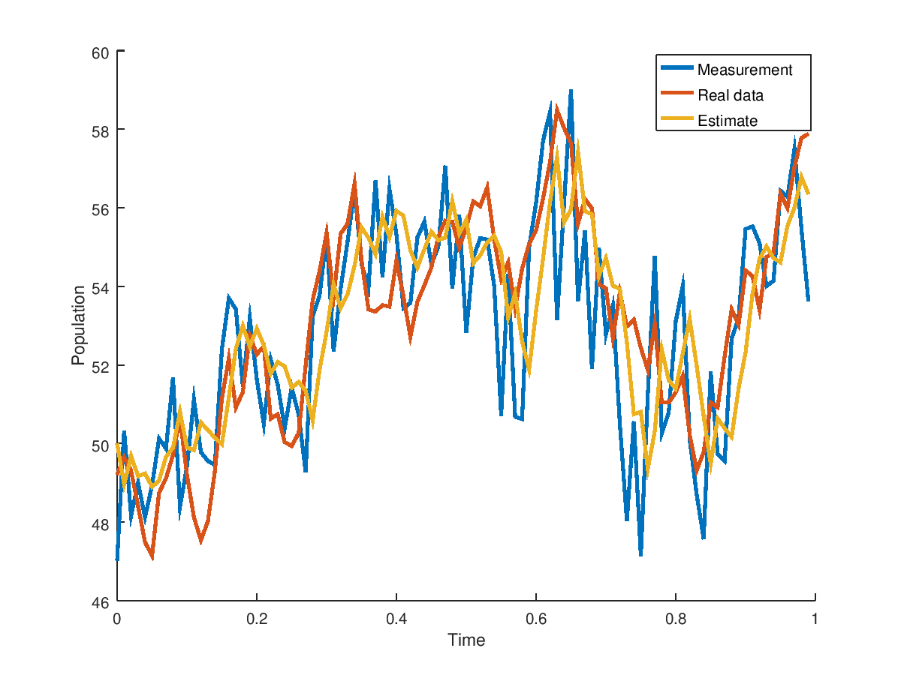

# Kalman filter 

### Code

The `Matlab` and `C++` code are featured in the `matlab_implementation` and `c++_implementation` respectively. The code is **well documented**:

 - [Matlab documentation](http://kalmanfilter.org/matlab/index.html)
 - [C++ documentation](http://kalmanfilter.org/cpp/index.html)


### Introduction

This repository contains `Matlab` and `C++` implementations of different Kalman filters. The insipiration to create this repository is rlabbe's github [repository](https://github.com/rlabbe/Kalman-and-Bayesian-Filters-in-Python) which is a great introduction to the Kalman filter in `python`. Go there first if you need a solid introduction the filter that will provide you with intuition behind its mechanics. 


This repository aims to provide users a basic and ready to use arsenal to use in exploring filtering. I spent some time working with the Kalman Filter as part of my [thesis](https://uwspace.uwaterloo.ca/bitstream/handle/10012/14740/Zonov_Stanislav.pdf ) (see chapter 3) where I coded up continuous-discrete extended Kalman filter and discrete-discrete extended Kalman filter. After coding up the two filters, I decided to keep things interesting and added other filters as well (_UKF_,_Ensemble_,_Particle_). In order to test my implementations, I used the filters in various contexts as well as checked if the steady state covariances match as explained in [1].


If you have further questions or want to contribute, then feel free to reach me at contact at zonov dot ca. This repository will grow to be a great collection of various filter implementations for anyone to use and refer to. For contribution, I don't just need help with implementing filters - most importantly I need examples in order to make the code more accessible for newcomers. **If you end up using the code and have a code sample you would like to share then please let me know - I'll feature it here!** If you do have additional filter implementation then I'll gladly make you a contributor to the repository.


[1] Smith, M. W. A., and A. P. Roberts. "An exact equivalence between the discrete-and continuous-time formulations of the Kalman filter." Mathematics and Computers in Simulation 20.2 (1978): 102-109


### Example


Here we will run through an example for the discrete discrete Extended Kalman filter that is of the square root flavour. Square root does not change the math behind the algorithm, but ensures that numerical rounding errors that are natural to a computer do not prevent the computed covariance matrices maintaining their property of being positive semi definite. For a linear model, the Extended Kalman Filter is equivalent to a regular Kalman filter. Check out this [thesis](https://uwspace.uwaterloo.ca/bitstream/handle/10012/14740/Zonov_Stanislav.pdf) - chapter 3 for a detailed explanation.

The code is in `matlab_implementation/discrete_discrete/ddekf.m`. The function header in `ddkef.m` is:


```Matlab
function [estimates, covariances ] =  ddekf(f_func,jacobian_func,dt_between_measurements,start_time,state_count,sensor_count,measurement_count,C,Q_root,R_root,P_0_root,x_0, measurements)
```

For those familiar with the Kalman filter and notation are familiar with the naming of the variables. However, to be extra sure it is always best to run `help ddekf`. We will break down the example below.


The example is located in `matlab_implementation/discrete_discrete/examples/logistic.m`. You can `cd` into the directory and then run `logistic` or do it step by step as described below. First set the seed and include the path to `matlab_implementation/discrete_discrete`:

```Matlab
clear all;
%include code 
addpath('..')

%setting the seed for repetition of experiment 
isOctave = exist('OCTAVE_VERSION', 'builtin') ~= 0;
if isOctave==true
	randn("seed",1);
else
	rng(1);
end
```

Consider the nonlinear discrete logistic growth model. The continuous example can be found in `CD-EKF` tab.

```Matlab
%define discrete logistic growth model and its jacobian
rate = 0.01;
max_pop = 100;
next_func = @(x,t) x + rate.*x.*(1 - x/max_pop) + 0.*t;%time independent
jacobian_func = @(x,t) 1 + rate - (2*rate*x)/max_pop  + 0.*t;
```

Set the time between each state evolution and the noise covariance and measurement matrices:

```Matlab
%in this model the time is only necessary
%for plotting an interpreting the results.
outputs = 1000;
t_start = 0;
t_final = 10;
dt = (t_final - t_start)/outputs;

%discrete noise covariance
Q_d = 1;
%sensor noise covariance
R_d = 3;
%measurement matrix
C = 1;

state_count = 1; 
sensor_count = 1;
```

Set the initial estimates, covariances as well as generate data in order to run the filter:

```Matlab
%model results if there was no process noise
ideal_data = zeros(state_count,outputs);
%actual data (with process noise) 
process_noise_data = zeros(state_count,outputs);
%noisy measurements of actual data
measurements = zeros(sensor_count,outputs);

%initial estimate and covariance
%the initial estimate in this case
%matches the actual data
x_0 = max_pop/2;
P_0 = 1;

%initial condition for ideal
%and real process data
x = x_0;
x_noise = x_0;

%generate the data
for ii=1:outputs
	x = next_func(x,ii);
	ideal_data(:,ii) = x;

	x_noise = next_func(x_noise,0) + chol(Q_d)'*randn(state_count,1);
	process_noise_data(:,ii) = x_noise;
	measurements(ii) = C*x_noise + chol(R_d)'*randn(sensor_count,1);
end
```

All the previous steps before were for just generating the data. The actual Kalman filter step is a one-liner. **Filter the data**:

```Matlab
%filter the noisy measurements
[estimates, covariances] = ddekf(next_func,jacobian_func,dt,t_start,state_count,...
	sensor_count,outputs,C,chol(Q_d)',chol(R_d)',chol(P_0)',x_0, measurements);
```

Plot the results:

```Matlab
%compare the measurements, estimates and true state.
%The ideal data is not plotted and is only for reference.
time = 0:dt:(outputs-1)*dt;
h = figure;
hold on;
plot(time,measurements); 
plot(time,process_noise_data);
plot(time,estimates(1:end-1));
legend('Measurement','Real data','Estimate');
xlabel('Time')
ylabel('Population')

h = figure;
hold on;
limit = 100;
plot(time(1:limit),measurements(1:limit),'LineWidth',2); 
plot(time(1:limit),process_noise_data(1:limit),'LineWidth',2);
plot(time(1:limit),estimates(1:limit),'LineWidth',2);
legend('Measurement','Real data','Estimate');
xlabel('Time')
ylabel('Population')
```

to produce (in Octave)




### Further reads

1. A very good (highly recommended) introduction to Kalman filtering concepts can be found [here](https://github.com/rlabbe/Kalman-and-Bayesian-Filters-in-Python). The repository organizes the concepts using python and a Jupyter notebook allowing the user to get a hands on intuition of the filter without getting bogged in notation and theory right away. It is a good source for understanding the implementation of the Kalman filter with respect to the predict and update phase.
2. Implementation details. Here are sources used for implemenation as well as good Kalman filter articles/books.
- Kailath, Thomas, Ali H. Sayed, and Babak Hassibi. Linear estimation. No. EPFL-BOOK-233814. Prentice Hall, 2000.
- Press, William H., et al. "Numerical recipes in C." Cambridge University Press 1 (1988): 3.
- Golub, Gene H., and Charles F. Van Loan. Matrix computations. Vol. 3. JHU Press, 2012.
- Frogerais, Paul, Jean-Jacques Bellanger, and Lotfi Senhadji. "Various ways to compute the continuous-discrete extended Kalman filter." IEEE Transactions on Automatic Control 57.4 (2012): 1000.
- Jorgensen, John Bagterp, et al. "A computationally efficient and robust implementation of the continuous-discrete extended Kalman filter." American Control Conference, 2007. ACC'07. IEEE, 2007. (not actually implementable due to square root of negative number confusion but useful information present)
- Smith, M. W. A., and A. P. Roberts. "An exact equivalence between the discrete-and continuous-time formulations of the Kalman filter." Mathematics and Computers in Simulation 20.2 (1978): 102-109.
- https://github.com/rlabbe/Kalman-and-Bayesian-Filters-in-Python
- Katzfuss, Matthias, Jonathan R. Stroud, and Christopher K. Wikle. "Understanding the ensemble Kalman filter." The American Statistician 70.4 (2016): 350-357.
- Asch, Mark, Marc Bocquet, and Maëlle Nodet. Data assimilation: methods, algorithms, and applications. Vol. 11. SIAM, 2016.
- Fowler, A. "Data Assimilation tutorial on the Kalman filter."." (2012).
- Simon, Dan. Optimal state estimation: Kalman, H infinity, and nonlinear approaches. John Wiley & Sons, 2006.
- Bar-Shalom, Yaakov, X. Rong Li, and Thiagalingam Kirubarajan. Estimation with applications to tracking and navigation: theory algorithms and software. John Wiley & Sons, 2004.
- Bucy, Richard S., and Peter D. Joseph. Filtering for stochastic processes with applications to guidance. Vol. 326. American Mathematical Soc., 2005.
